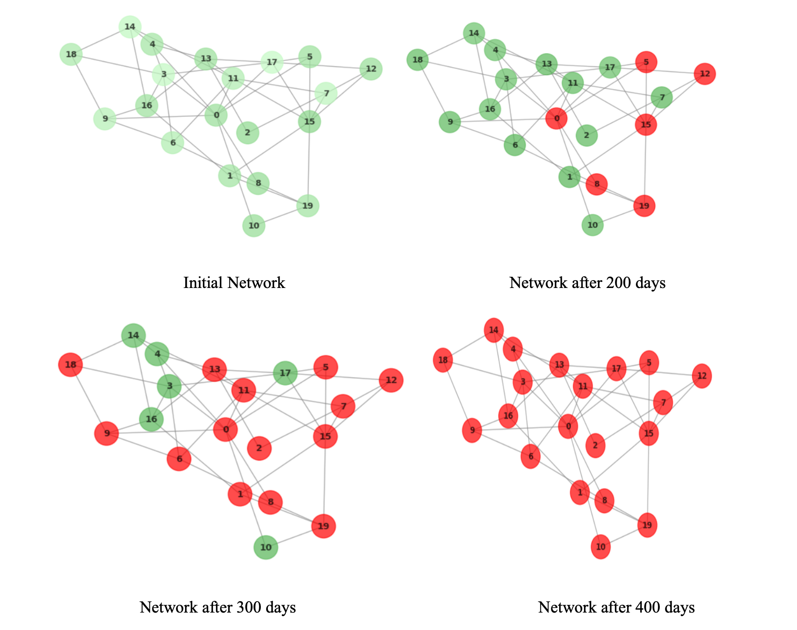
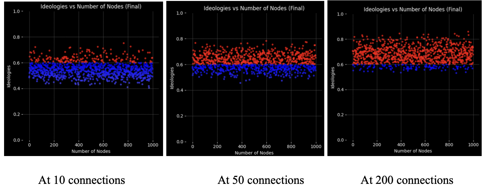
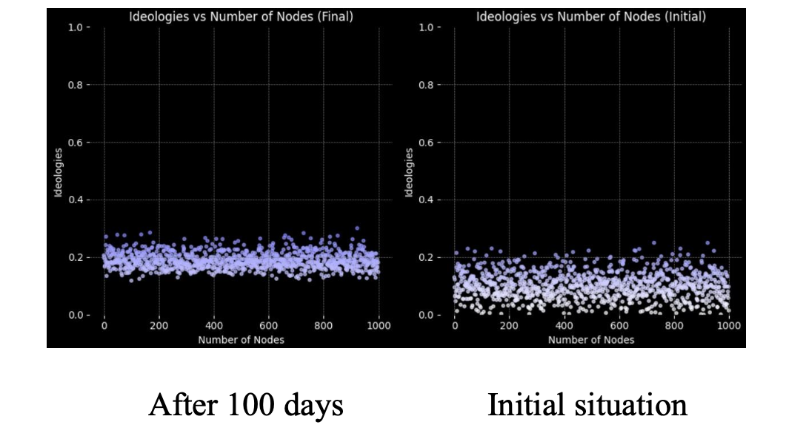
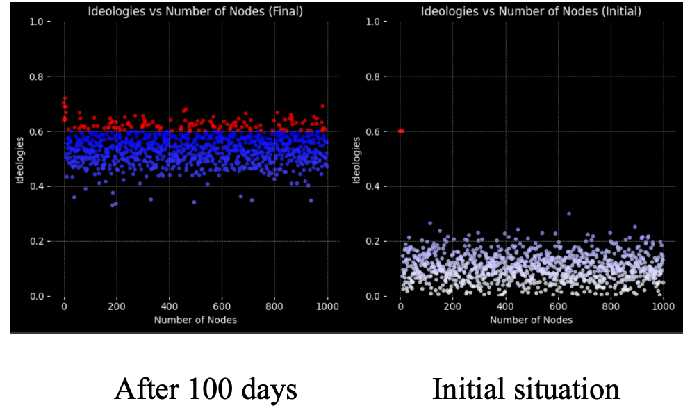
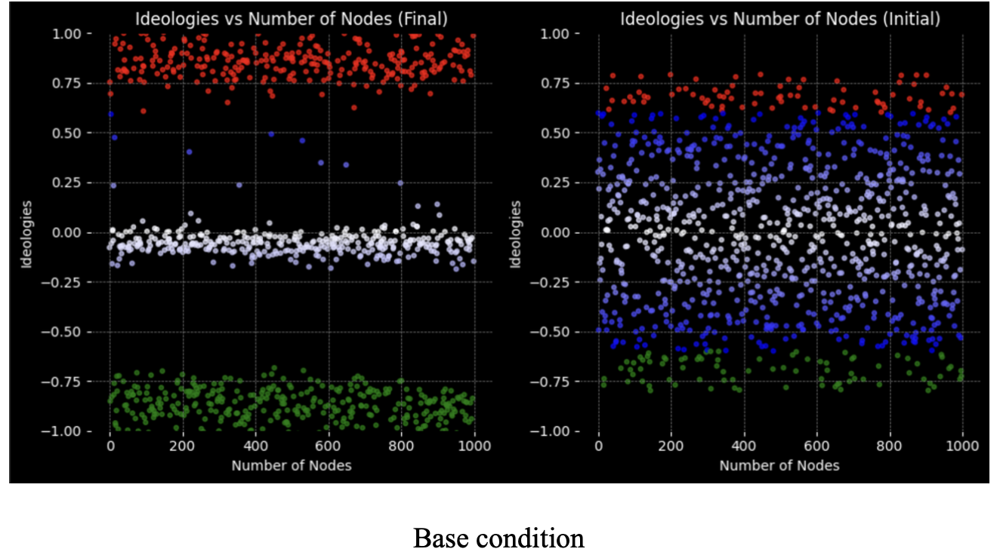
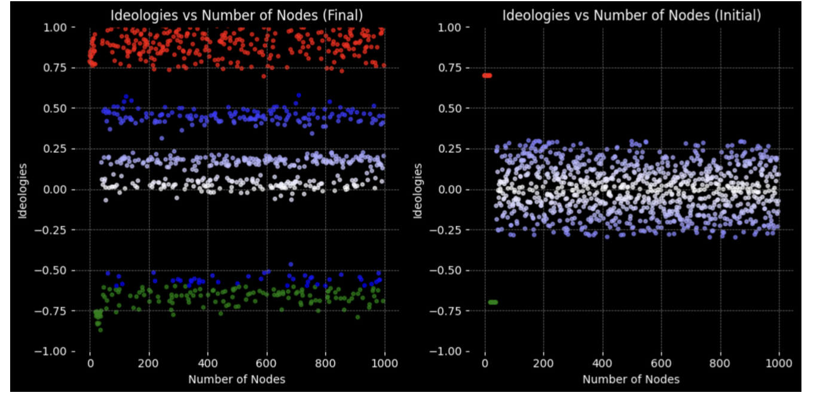
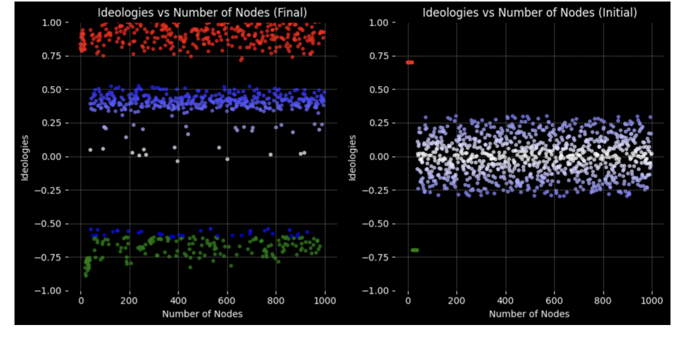

# Numerical Analysis Of Ideological Outreach In Social Media Networks

This project aims to develop a numerical simulation model that analyzes the process of ideological outreach within social media networks. By employing numerical methods, this study seeks to uncover the mechanisms and patterns through which various ideologies spread across digital platforms, enabling the formulation of informed strategies to understand and engage with these dissemination processes effectively.

## Table of Contents

- [Introduction](#introduction)
- [Network Model](#network-model)
- [Assumptions](#assumptions)
- [Attributes and Parameters](#attributes-and-parameters)
- [Governing Equations](#governing-equations)
- [Initial Conditions](#initial-conditions)
- [Numerical Solution](#numerical-solution)
- [Numerical Simulation Algorithm](#numerical-simulation-algorithm)
- [Scenario-Specific Sensitivity Analysis](#scenario-specific-sensitivity-analysis)
  - [Small Network Analysis (Single Sect Model)](#small-network-analysis-single-sect-model)
  - [Community Type Network Analysis (Single Sect Model)](#community-type-network-analysis-single-sect-model)
  - [Twitter Type Network Analysis (Influencer Model)](#twitter-type-network-analysis-influencer-model)
  - [Election Campaigning Analysis (Dual Sect Model)](#election-campaigning-analysis-dual-sect-model)
- [References](#references)

## Introduction

Ideological Outreach refers to the deliberate dissemination and promotion of specific beliefs, ideologies, or perspectives through social media networks. This project analyzes ideological outreach and the most important governing attributes in the following scenarios:

1. Small Network
2. Community Type Network
3. Twitter-like network
4. Election Campaigning Analysis

## Network Model

The NetworkX library of Python is used to create a synthetic social media network. In this network, the nodes represent people, and the edges represent connections between people on the platform. Each person (node) is assigned attributes quantifying content engagement, social interaction, receptiveness, and network position.

## Assumptions

1. A network of 1000 people has been analyzed to keep the algorithm's runtime within limits.
2. The distribution of properties of individuals, like activity and number of connections, has been considered to be Gaussian in nature.

## Attributes and Parameters

The following characteristics characterize each person (node):

1. **Ideology (i)**: This parameter demarcates the current level of acceptance of the idea by the person. A negative value indicates opposition to the idea. The scale is not linear in nature, and the growth rate is logarithmic.

2. **Receptiveness (R)**: Refers to an individual's openness and willingness to accept and engage with new ideologies presented within the social media environment.

3. **Activity (A)**: Activity signifies the level of engagement and participation of an individual within the social media network, which sums up actions such as posting, commenting, sharing, and interacting with other users and content.

4. **Persuasiveness (P)**: Persuasion power measures an individual's ability to influence and convince others regarding specific ideologies or viewpoints through their communication and persuasive skills within the social media space.

5. **Suggestibility (S)**: Suggestibility represents the degree to which an individual is prone to adopting or being influenced by external ideologies presented within the social media network, indicating their susceptibility to external influence.

6. **Exponential Factor (E)**: Represents the size of the network.

7. **Acceptance Value**: The ideological value upon reaching which an individual is considered to have accepted the idea.

8. **Single Sect Model**: No opposing ideology is considered. The values of ideologies are zero or positive.

9. **Dual Sect Model**: Opposing ideologies are considered. The value of ideologies can be negative, zero, or positive.

## Governing Equations

The governing equations for the spread of ideas within the network are derived based on the influence of interactions, exposure, and resistance to new ideas.

### Persuasion Power (P)

$$P_a = i_a A_a$$

### Suggestibility (S)

$$S_a = i_a A_a R_a^2$$

### Ideological Evolution

For case (I): Both individuals have the same ideological alignment.

$$\frac{di_b}{dt} = (\frac{E^{P_a} - 1}{E - 1})(E^{-S_b})$$

For case (II): The two individuals had opposing ideologies.

$$\frac{di_b}{dt} = (\frac{E^{P_a} - 1}{E - 1})(E^{\frac{S_b}{10}})$$

## Initial Conditions

- Truncated Gaussian distribution has been used to distribute attribute values to people (nodes).
- Activity and Receptiveness: The general distribution of activity has the following parameters - μ = 1, σ = 0.1, a = 0.9, b = 1.1.
- Initial Ideology Values: Relevant initial ideological values have been considered in respective scenarios.
- Duration: The algorithm is run for a period of 100 days, that is, 100 iterations.

## Numerical Solution

The Euler's first-order approximation method is used to perform the iterations and update the ideological values over time.

For case (I):

$$(i_b)_{j+1} = (i_b)_j + (\frac{E^{P_a} - 1}{E - 1})(E^{-S_b})$$

For case (II):

$$(i_b)_{j+1} = (i_b)_j + (\frac{E^{P_a} - 1}{E - 1})(E^{\frac{S_b}{10}})$$

## Numerical Simulation Algorithm

The numerical simulation algorithm follows these steps:

1. Create a network of nodes (people) and distribute the number of connections for each person randomly using a truncated Gaussian distribution.
2. Create an adjacency list based on the number of connections of each node.
3. For each node, create a vector storing the attributes (ideology, activity, and receptiveness) and initialize their values using a truncated Gaussian distribution.
4. Calculate the attributes of persuasion power and suggestibility for each individual using the derived equations.
5. Update the attributes of each node after a day (in each iteration) by calculating the updated ideologies based on interactions with direct connections.
6. Update the final ideology of nodes after a day (end of an iteration) based on the calculated values from the previous step.
7. Calculate the new values of persuasion power and suggestibility using the updated ideology values.
8. Run the above algorithm for the required number of iterations, where one iteration corresponds to one day.

## Scenario-Specific Sensitivity Analysis

### Small Network Analysis (Single Sect Model)

This analysis elucidates the understanding of the mathematical model and the simulation algorithm, as well as verifies the accuracy of the model by analyzing a small network of 20 people with a single-sect model (no opposing view).

Visualization Of Simulation On Small Network:

### Community Type Network Analysis (Single Sect Model)

This analysis aims to understand the relationship between the network's overall ideological acceptance and how strongly connected the network is. The number of connections of an individual is varied from 10 to 200.

Network Evolution:

The analysis shows that as the network becomes more strongly connected, a higher percentage of people accept the ideology in the same time period of 100 days.

### Twitter Type Network Analysis (Influencer Model)

The aim is to understand how powerfully a highly connected individual (influencer) can impact the overall ideological alignment of the network. A few individuals (influencers) with a high number of connections (300) are induced in the network.

The following graphs shows the network initially and after 100 days without the influencers:

The following graphs show the network after 100 days with the influencers:

The analysis shows that the influencers were able to convince people much more of their ideologies in comparison to a normal community-type network.

### Election Campaigning Analysis (Dual Sect Model)

This analysis aims to understand the most important factors that influence people's choice in an election. Two parties, A and B, are considered. Positive ideology value indicates support for party A, and negative ideology value indicates support for party B.

Base Condition:
After 100 days:
- Party A - 33.3%
- Party B - 14.4%

Impact of High Connections:
Party A is given 20 people with 200 connections each.
After 100 days:
- Party A - 39.8%
- Party B - 16.2%

High Connections versus High Count:
Party A is given 4 people with 400 connections, and Party B is given 20 people with 50 connections.
After 100 days:
- Party A - 39.2%
- Party B - 7%

The analysis shows that highly influential individuals (with high connections) win over a large number of less connected individuals from the opposing party.

## References

[1] 'Truncated Normal Distribution', Wikipedia.org, Link: https://en.wikipedia.org/wiki/Truncated_normal_distribution
 
[2] 'Inside Twitter: An In-Depth Look Inside the Twitter World', Sysomos, April 2014.
